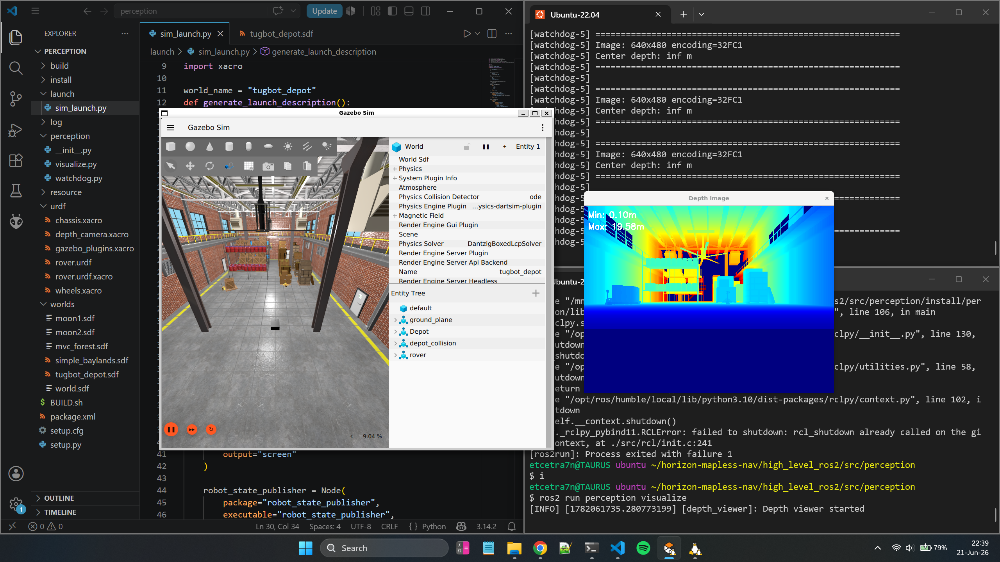

# Perception package

ROS 2 package to simulate a zed2 camera in a virtual world using gazebo

To use this package, follow the below instruction to start the gazebo simulation. This will publish depth image to `/depth/image` in `32FC1` format, which can be used for any future packages



Publishes the following topics:
- `/depth/image`
- `/depth/camera_info`

## Prerequisites

- ROS 2 Humble
- Gazebo Sim
- `xacro`
- `ros_gz_bridge`

## Build

Source ROS 2:

```sh
source /opt/ros/humble/setup.bash
```

Generate the URDF: (_Only needed if you have modified the urdf files_)

```sh
xacro urdf/rover.urdf.xacro > urdf/rover.urdf
```

Build the workspace:

```sh
colcon build
```

Source the workspace:

```sh
source install/setup.bash
```

## Run

Launch the Gazebo simulation:

```sh
ros2 launch perception sim_launch.py
```

#### Visualizer (optional)

(_optional_) In another terminal, source the workspace again and start the depth visualizer / monitor:

```sh
source install/setup.bash
ros2 run perception visualize
```
